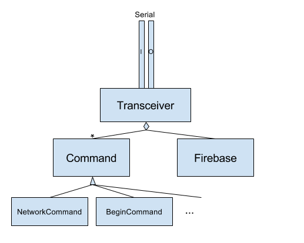

Overview:

We create a SerialTransceiver object that will manage the serial connection. It will read the first word on a line to determine which command is being called and construct the appropriate Command subclass to handle the interaction. Commands will be short lived objects with no state between calls, they will own the serial connection until they hand it back and are responsible for handling all necessary input and leaving the input line in a clean state for the next command.

We will aim to keep the Transceiver/Command interaction generic enough to enable creating additional Protocol Transceivers in the future.

The Transceiver object will also own the Firebase object and present it to each command during construction. The Firebase object is our link to the firebase backend.

