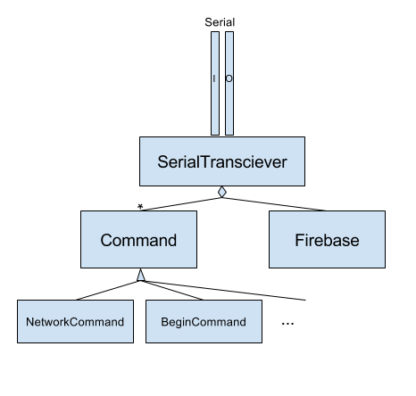

Overview:

We create a Transceiver object that will manage the serial connection. It will do command detection and hand off to the appropriate Command object to handle the interaction. The Command object will be subclassed for each type of command we will receive and will handle the processing of the command and generating the response.

The Transceiver object will also own the Firebase object and present it to each command during processing. The Firebase object is our link to the firebase backend.

